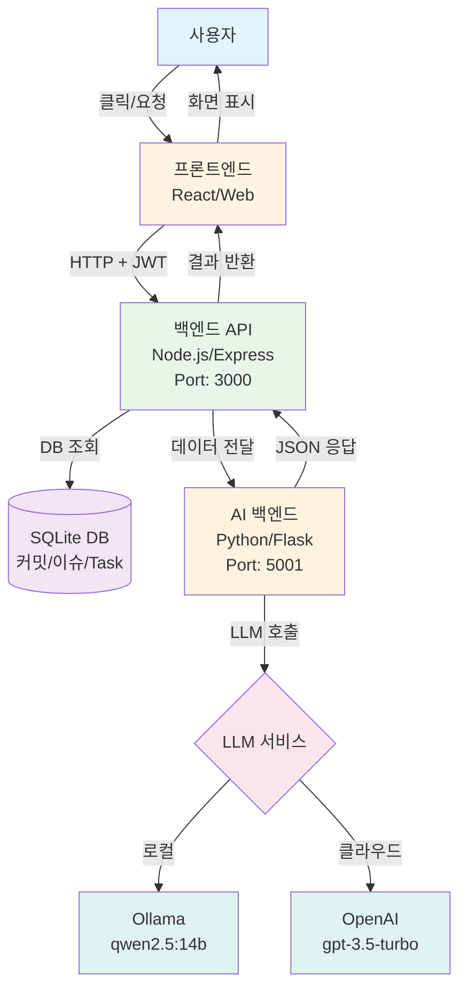
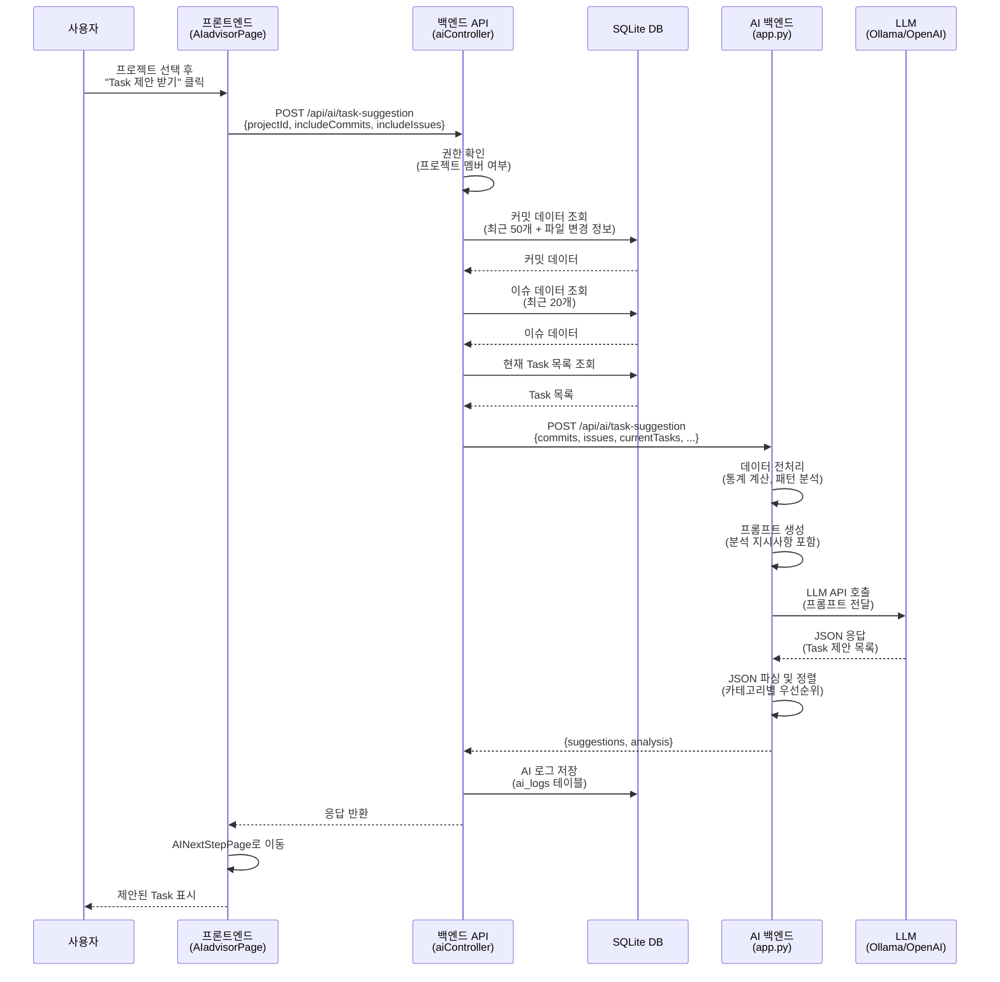
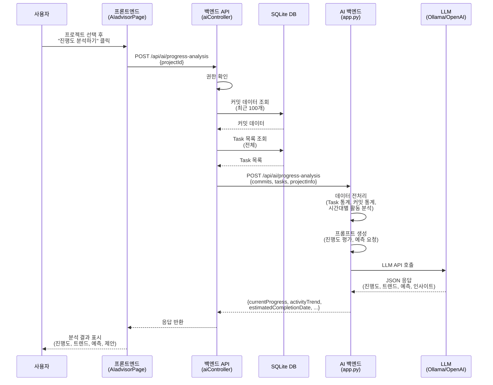
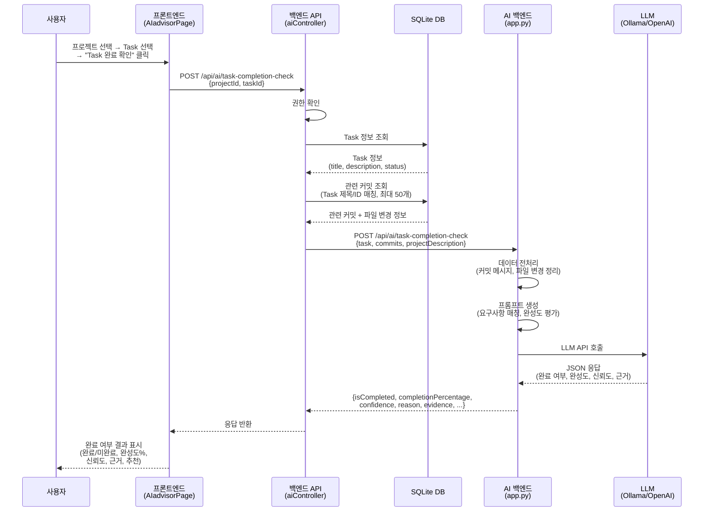

# AI 기능 아키텍처 및 흐름도 문서

## 개요

이 문서는 To-Do AI 프로젝트의 3가지 핵심 AI 기능의 아키텍처와 데이터 흐름을 도식화하여 설명합니다.

---

## 시스템 아키텍처 개요

### 전체 시스템 구조도



### 텍스트 다이어그램

```
┌─────────────────┐
│   프론트엔드     │
│  (React/Web)    │
└────────┬────────┘
         │ HTTP Request (JWT 인증)
         ▼
┌─────────────────┐
│   백엔드 API     │
│  (Node.js/      │
│   Express)      │
│  Port: 3000     │
└────────┬────────┘
         │ 데이터 수집 (DB 조회)
         │
         ▼
┌─────────────────┐
│   SQLite DB     │
│  (커밋, 이슈,    │
│   Task 데이터)   │
└────────┬────────┘
         │
         │ 수집된 데이터 전달
         ▼
┌─────────────────┐
│   AI 백엔드      │
│  (Python/Flask) │
│  Port: 5001     │
└────────┬────────┘
         │ LLM API 호출
         ▼
┌─────────────────┐
│   LLM 서비스     │
│  (Ollama 또는    │
│   OpenAI API)   │
└─────────────────┘
```

---

## 기능 1: Task 제안 (Task Suggestion)

### 기능 설명
GitHub 커밋 히스토리, 이슈, 현재 Task 목록을 분석하여 새로운 Task를 제안합니다. 코드 품질, 보안, 성능, 유지보수성 등 다양한 관점에서 개선점을 찾아냅니다.

### 데이터 흐름도 (Mermaid)



### 데이터 흐름도 (텍스트)

```
[사용자]
  │
  │ 1. 프로젝트 선택 후 "Task 제안 받기" 클릭
  ▼
[프론트엔드: AIadvisorPage.jsx]
  │
  │ 2. getTaskSuggestions(projectId, {includeCommits, includeIssues})
  ▼
[백엔드: aiController.taskSuggestion]
  │
  │ 3. 권한 확인 (프로젝트 멤버 여부)
  │
  │ 4. 데이터 수집:
  │    - 커밋 데이터 (최근 50개)
  │      * commit_sha, commit_message, author, commit_date
  │      * lines_added, lines_deleted, files_changed
  │      * 각 커밋의 파일 변경 정보 (project_commit_files)
  │    - 이슈 데이터 (최근 20개)
  │      * issue_number, title, body, state, labels
  │    - 현재 Task 목록
  │      * title, description, status
  │    - 프로젝트 정보
  │      * description, github_repo
  │
  │ 5. AI 백엔드로 요청 전달
  │    POST http://localhost:5001/api/ai/task-suggestion
  │    Body: { commits, issues, currentTasks, projectDescription, githubRepo }
  ▼
[AI 백엔드: app.py - task_suggestion()]
  │
  │ 6. 데이터 전처리:
  │    - 커밋 통계 계산 (총 라인 추가/삭제, 파일 변경 패턴)
  │    - 이슈 분류 (열린 이슈, 라벨별 통계)
  │    - Task 상태 통계
  │
  │ 7. 프롬프트 생성:
  │    - 프로젝트 정보
  │    - 코드 변경 통계
  │    - 최근 커밋 분석
  │    - 이슈 현황
  │    - 현재 작업 현황
  │    - 분석 지시사항 (기능 개발, 코드 품질, 보안, 성능, 유지보수성)
  │
  │ 8. LLM 호출:
  │    - Ollama: POST http://localhost:11434/api/chat
  │      또는
  │    - OpenAI: openai_client.chat.completions.create()
  │
  │ 9. JSON 응답 파싱:
  │    [
  │      {
  │        "title": "...",
  │        "description": "...",
  │        "category": "feature|refactor|security|performance|maintenance",
  │        "priority": "High|Medium|Low",
  │        "estimatedHours": 숫자,
  │        "reason": "..."
  │      }
  │    ]
  │
  │ 10. 카테고리별 정렬 (security > refactor > feature > performance > maintenance)
  │
  │ 11. 응답 반환:
  │     {
  │       "suggestions": [...],
  │       "analysis": {
  │         "totalCommits": 숫자,
  │         "totalIssues": 숫자,
  │         "totalTasks": 숫자,
  │         "hasEnoughData": boolean
  │       }
  │     }
  ▼
[백엔드: aiController]
  │
  │ 12. AI 로그 저장 (ai_logs 테이블)
  │
  │ 13. 응답 반환
  ▼
[프론트엔드]
  │
  │ 14. AINextStepPage로 이동하여 제안된 Task 표시
  ▼
[사용자]
```

### 주요 처리 단계

1. **데이터 수집 단계**
   - 커밋: 최근 50개 커밋 + 각 커밋의 파일 변경 정보 (최대 10개 파일)
   - 이슈: 최근 20개 이슈
   - Task: 프로젝트의 모든 Task

2. **AI 분석 단계**
   - 코드 변경 패턴 분석
   - 복잡도 분석 (대량 변경 파일, 반복 변경 영역)
   - 보안 이슈 식별
   - 기능 격차 분석
   - 기술 부채 식별

3. **제안 생성 단계**
   - 최대 8개 Task 제안
   - 카테고리별 균형 배분
   - 우선순위 부여 (High: 보안/심각한 기술 부채)

---

## 기능 2: 진행도 분석 (Progress Analysis)

### 기능 설명
프로젝트의 커밋 활동과 Task 진행 상황을 종합적으로 분석하여 현재 진행도를 평가하고, 완료 예측 및 지연 위험도를 제공합니다.

### 데이터 흐름도 (Mermaid)



### 데이터 흐름도 (텍스트)

```
[사용자]
  │
  │ 1. 프로젝트 선택 후 "진행도 분석하기" 클릭
  ▼
[프론트엔드: AIadvisorPage.jsx]
  │
  │ 2. getProgressAnalysis(projectId)
  ▼
[백엔드: aiController.progressAnalysis]
  │
  │ 3. 권한 확인
  │
  │ 4. 데이터 수집:
  │    - 커밋 데이터 (최근 100개)
  │      * commit_sha, commit_message, author, commit_date
  │      * lines_added, lines_deleted, files_changed
  │    - Task 목록 (전체)
  │      * id, title, description, status, due_date, created_at
  │    - 프로젝트 정보
  │      * description, created_at
  │
  │ 5. AI 백엔드로 요청 전달
  │    POST http://localhost:5001/api/ai/progress-analysis
  │    Body: { commits, tasks, projectDescription, projectStartDate, projectDueDate }
  ▼
[AI 백엔드: app.py - progress_analysis()]
  │
  │ 6. 데이터 전처리:
  │    - Task 통계:
  │      * 총 Task 수, todo, in_progress, done
  │      * Task 진행률 계산
  │    - 커밋 통계:
  │      * 총 커밋 수, 총 라인 추가/삭제
  │    - 시간대별 활동 분석:
  │      * 최근 7일 커밋 수
  │      * 최근 30일 커밋 수
  │
  │ 7. 프롬프트 생성:
  │    - 프로젝트 정보 (시작일, 마감일)
  │    - Task 현황 (진행률 포함)
  │    - 코드 활동 현황 (시간대별 통계)
  │    - 분석 요청사항:
  │      * 현재 진행도 평가 (0-100%)
  │      * 활동 패턴 분석 (증가/안정/감소)
  │      * 완료 예측
  │      * 지연 위험도 평가
  │      * 개선 제안
  │
  │ 8. LLM 호출
  │
  │ 9. JSON 응답 파싱:
  │    {
  │      "currentProgress": 0-100,
  │      "activityTrend": "increasing|stable|decreasing",
  │      "estimatedCompletionDate": "YYYY-MM-DD" 또는 null,
  │      "delayRisk": "Low|Medium|High",
  │      "insights": ["인사이트 1", "인사이트 2"],
  │      "recommendations": ["제안 1", "제안 2"]
  │    }
  │
  │ 10. 응답 반환
  ▼
[백엔드: aiController]
  │
  │ 11. 응답 반환
  ▼
[프론트엔드]
  │
  │ 12. 분석 결과 표시 (진행도, 트렌드, 예측, 인사이트, 제안)
  ▼
[사용자]
```

### 주요 분석 항목

1. **현재 진행도 평가**
   - Task 진행률과 코드 활동을 종합하여 실제 진행도 계산 (0-100%)

2. **활동 패턴 분석**
   - 최근 7일 vs 30일 커밋 활동 비교
   - 증가/안정/감소 트렌드 판단

3. **완료 예측**
   - 현재 속도 기반 완료 시기 예측

4. **지연 위험도**
   - 마감일 대비 지연 가능성 평가 (Low/Medium/High)

5. **개선 제안**
   - 진행도 향상을 위한 구체적 제안

---

## 기능 3: Task 완료 여부 판단 (Task Completion Check)

### 기능 설명
Task의 요구사항과 실제 코드 변경사항(커밋 메시지, 파일 변경)을 비교하여 Task가 완료되었는지 판단합니다.

### 데이터 흐름도 (Mermaid)



### 데이터 흐름도 (텍스트)

```
[사용자]
  │
  │ 1. 프로젝트 선택 → Task 선택 → "Task 완료 확인" 클릭
  ▼
[프론트엔드: AIadvisorPage.jsx]
  │
  │ 2. checkTaskCompletion(projectId, taskId)
  ▼
[백엔드: aiController.taskCompletionCheck]
  │
  │ 3. 권한 확인
  │
  │ 4. 데이터 수집:
  │    - Task 정보 조회:
  │      * id, title, description, status
  │    - 관련 커밋 조회 (최대 50개):
  │      * 조건: commit_message에 Task 제목 포함
  │             또는 commit_message에 #taskId 포함
  │             또는 task_id가 일치
  │      * 각 커밋의 파일 변경 정보 (최대 10개 파일)
  │    - 프로젝트 정보
  │
  │ 5. AI 백엔드로 요청 전달
  │    POST http://localhost:5001/api/ai/task-completion-check
  │    Body: { task, commits, projectDescription }
  ▼
[AI 백엔드: app.py - task_completion_check()]
  │
  │ 6. 데이터 전처리:
  │    - 커밋 메시지 정리 (최근 20개)
  │    - 파일 변경 정보 정리
  │    - 라인 추가/삭제 통계
  │
  │ 7. 프롬프트 생성:
  │    - Task 정보 (제목, 설명, 현재 상태)
  │    - 관련 커밋 및 코드 변경사항:
  │      * 커밋 메시지
  │      * 변경된 파일 목록
  │      * 라인 추가/삭제 수
  │    - 판단 기준:
  │      * 요구사항 매칭 여부
  │      * 완성도 평가
  │      * 신뢰도 평가
  │
  │ 8. LLM 호출
  │
  │ 9. JSON 응답 파싱:
  │    {
  │      "isCompleted": true|false,
  │      "completionPercentage": 0-100,
  │      "confidence": "high|medium|low",
  │      "reason": "판단 근거",
  │      "evidence": ["근거 1", "근거 2"],
  │      "recommendation": "추가 작업 제안 또는 완료 처리 제안"
  │    }
  │
  │ 10. 응답 반환
  ▼
[백엔드: aiController]
  │
  │ 11. 응답 반환
  ▼
[프론트엔드]
  │
  │ 12. 완료 여부 결과 표시:
  │     - 완료 여부 (완료/미완료)
  │     - 완성도 (%)
  │     - 신뢰도
  │     - 판단 근거
  │     - 증거 목록
  │     - 추천 사항
  ▼
[사용자]
```

### 주요 판단 기준

1. **요구사항 매칭**
   - Task 제목/설명의 요구사항이 커밋 메시지나 파일 변경사항에서 구현되었는지 확인

2. **완성도 평가**
   - 부분 완료 vs 완전 완료 판단
   - 완성도 퍼센트 계산 (0-100%)

3. **신뢰도 평가**
   - 판단의 신뢰도 (high/medium/low)
   - 관련 커밋이 충분한지, 증거가 명확한지에 따라 결정

4. **증거 제시**
   - 판단 근거가 되는 커밋 메시지나 파일 변경사항 나열

---

## 기술 스택 및 구성 요소

### 프론트엔드
- **프레임워크**: React
- **API 호출**: Axios
- **인증**: JWT Token (Bearer)
- **주요 파일**:
  - `morpheus-react/web/src/pages/AIadvisorPage.jsx`
  - `morpheus-react/web/src/api/ai.js`

### 백엔드 API
- **프레임워크**: Node.js + Express
- **데이터베이스**: SQLite
- **인증**: JWT 미들웨어 (`authenticateToken`)
- **주요 파일**:
  - `backend/routes/ai.js`
  - `backend/controllers/aiController.js`

### AI 백엔드
- **프레임워크**: Python + Flask
- **LLM 옵션**:
  - **Ollama** (로컬 모델, 기본값): `qwen2.5:14b`
  - **OpenAI** (클라우드, 선택사항): `gpt-3.5-turbo`
- **환경 변수**:
  - `OLLAMA_BASE_URL`: Ollama 서버 URL (기본값: `http://localhost:11434`)
  - `OLLAMA_MODEL`: 사용할 Ollama 모델 (기본값: `qwen2.5:14b`)
  - `OPENAI_API_KEY`: OpenAI API 키 (선택사항)
  - `USE_OPENAI`: OpenAI 사용 여부 (`true`/`false`)
- **주요 파일**:
  - `ai-backend/app.py`

### 데이터베이스 스키마 (관련 테이블)

#### `project_commits`
- 커밋 기본 정보 저장
- 주요 컬럼: `commit_sha`, `commit_message`, `author`, `commit_date`, `lines_added`, `lines_deleted`, `files_changed`

#### `project_commit_files`
- 각 커밋의 파일별 변경 정보
- 주요 컬럼: `commit_sha`, `file_path`, `status`, `additions`, `deletions`

#### `project_issues`
- GitHub 이슈 정보
- 주요 컬럼: `issue_number`, `title`, `body`, `state`, `labels`

#### `tasks`
- 프로젝트 Task 정보
- 주요 컬럼: `id`, `title`, `description`, `status`, `due_date`, `created_at`

#### `ai_logs`
- AI 요청 로그 저장
- 주요 컬럼: `user_id`, `project_id`, `type`, `input`, `output`, `created_at`

---

## API 엔드포인트 상세

### 1. Task 제안

**엔드포인트**: `POST /api/ai/task-suggestion`

**인증**: JWT Token 필요

**Request Body**:
```json
{
  "projectId": 1,
  "includeCommits": true,
  "includeIssues": true
}
```

**Response**:
```json
{
  "success": true,
  "data": {
    "suggestions": [
      {
        "title": "리팩토링 제안",
        "description": "코드 중복 제거 필요",
        "category": "refactor",
        "priority": "Medium",
        "estimatedHours": 4,
        "reason": "분석 근거"
      }
    ],
    "analysis": {
      "totalCommits": 50,
      "totalIssues": 10,
      "totalTasks": 20,
      "hasEnoughData": true
    }
  },
  "message": "Task 제안이 생성되었습니다."
}
```

---

### 2. 진행도 분석

**엔드포인트**: `POST /api/ai/progress-analysis`

**인증**: JWT Token 필요

**Request Body**:
```json
{
  "projectId": 1
}
```

**Response**:
```json
{
  "success": true,
  "data": {
    "currentProgress": 65,
    "activityTrend": "increasing",
    "estimatedCompletionDate": "2024-12-31",
    "delayRisk": "Low",
    "insights": [
      "최근 활동이 증가하고 있습니다.",
      "Task 진행률이 코드 활동과 일치합니다."
    ],
    "recommendations": [
      "현재 속도를 유지하세요.",
      "완료된 Task를 정리하세요."
    ]
  },
  "message": "진행도 분석이 완료되었습니다."
}
```

---

### 3. Task 완료 여부 판단

**엔드포인트**: `POST /api/ai/task-completion-check`

**인증**: JWT Token 필요

**Request Body**:
```json
{
  "projectId": 1,
  "taskId": 5
}
```

**Response**:
```json
{
  "success": true,
  "data": {
    "isCompleted": true,
    "completionPercentage": 90,
    "confidence": "high",
    "reason": "Task 요구사항이 커밋에서 구현되었습니다.",
    "evidence": [
      "커밋 메시지에 '사용자 인증 기능 구현' 포함",
      "auth 관련 파일 변경 확인"
    ],
    "recommendation": "완료 처리해도 됩니다. 다만 테스트 코드 추가를 권장합니다."
  },
  "message": "Task 완료 여부 분석이 완료되었습니다."
}
```

---

## 에러 처리

### 공통 에러 응답 형식

```json
{
  "success": false,
  "error": {
    "code": "ERROR_CODE",
    "message": "에러 메시지"
  }
}
```

### 주요 에러 코드

- `MISSING_FIELDS`: 필수 필드 누락
- `FORBIDDEN`: 프로젝트 접근 권한 없음
- `SERVER_ERROR`: 서버 내부 오류
- `AI_BACKEND_ERROR`: AI 백엔드 오류
- `AI_BACKEND_UNAVAILABLE`: AI 백엔드 연결 불가
- `AI_REQUEST_FAILED`: AI 요청 처리 실패

---

## 성능 및 제한사항

### 타임아웃
- AI 백엔드 요청: 120초 (2분)

### 데이터 제한
- Task 제안: 최근 50개 커밋, 최근 20개 이슈
- 진행도 분석: 최근 100개 커밋
- Task 완료 확인: 최근 50개 관련 커밋, 각 커밋당 최대 10개 파일

### LLM 응답 처리
- JSON 파싱 실패 시 텍스트 응답으로 대체
- 코드 블록 제거 후 JSON 추출 시도

---

## 향후 개선 사항

1. **캐싱**: 동일 프로젝트의 반복 요청 캐싱
2. **스트리밍**: LLM 응답 스트리밍으로 응답 시간 개선
3. **배치 처리**: 여러 Task 동시 분석
4. **히스토리**: 분석 결과 히스토리 저장 및 추적
5. **알림**: 지연 위험도가 높을 때 알림 기능

---

## 3가지 AI 기능 비교표

| 항목 | Task 제안 | 진행도 분석 | Task 완료 여부 판단 |
|------|-----------|-------------|-------------------|
| **주요 목적** | 새로운 Task 제안 | 프로젝트 진행도 평가 및 예측 | Task 완료 여부 자동 판단 |
| **입력 데이터** | 커밋(50개), 이슈(20개), 현재 Task | 커밋(100개), Task(전체) | Task 정보, 관련 커밋(50개) |
| **분석 관점** | 기능 개발, 코드 품질, 보안, 성능, 유지보수성 | 진행률, 활동 패턴, 완료 예측, 지연 위험도 | 요구사항 매칭, 완성도, 신뢰도 |
| **출력 형식** | Task 제안 목록 (최대 8개) | 진행도 %, 트렌드, 예측, 인사이트 | 완료 여부, 완성도 %, 신뢰도, 근거 |
| **사용 시점** | 프로젝트 개선점 찾기 | 프로젝트 진행 상황 파악 | Task 완료 확인 필요 시 |
| **응답 시간** | 중간 (복잡한 분석) | 빠름 (통계 기반) | 중간 (매칭 분석) |
| **데이터 의존성** | 높음 (커밋/이슈 필요) | 중간 (커밋/Task 필요) | 높음 (관련 커밋 필요) |
| **로그 저장** | ✅ (ai_logs) | ❌ | ❌ |

---

## 핵심 요약

### 시스템 아키텍처
- **3계층 구조**: 프론트엔드 (React) → 백엔드 API (Node.js) → AI 백엔드 (Python/Flask)
- **데이터 흐름**: 사용자 요청 → DB 조회 → AI 분석 → 결과 반환
- **LLM 옵션**: Ollama (로컬, 기본) 또는 OpenAI (클라우드, 선택)

### 공통 처리 흐름
1. **인증**: JWT Token 기반 사용자 인증
2. **권한 확인**: 프로젝트 멤버 여부 확인
3. **데이터 수집**: SQLite DB에서 필요한 데이터 조회
4. **AI 분석**: AI 백엔드로 데이터 전달 및 LLM 호출
5. **결과 반환**: JSON 형식으로 분석 결과 반환

### 주요 특징
- **유연한 LLM 선택**: Ollama (로컬) 또는 OpenAI (클라우드) 선택 가능
- **강력한 프롬프트 엔지니어링**: 각 기능별로 최적화된 프롬프트 사용
- **에러 처리**: 단계별 에러 처리 및 사용자 친화적 메시지 제공
- **JSON 응답**: 구조화된 JSON 형식으로 일관된 응답 제공

### 데이터베이스 활용
- **커밋 데이터**: `project_commits`, `project_commit_files` 테이블 활용
- **이슈 데이터**: `project_issues` 테이블 활용
- **Task 데이터**: `tasks` 테이블 활용
- **로그 저장**: `ai_logs` 테이블에 Task 제안 로그 저장

---

## 참고 문서

- [AI 기능 명세서](./AI_기능_명세서.md)
- [백엔드 설계 문서](./BACKEND_DESIGN.md)
- [프론트엔드 설계 문서](./FRONTEND_DESIGN.md)

